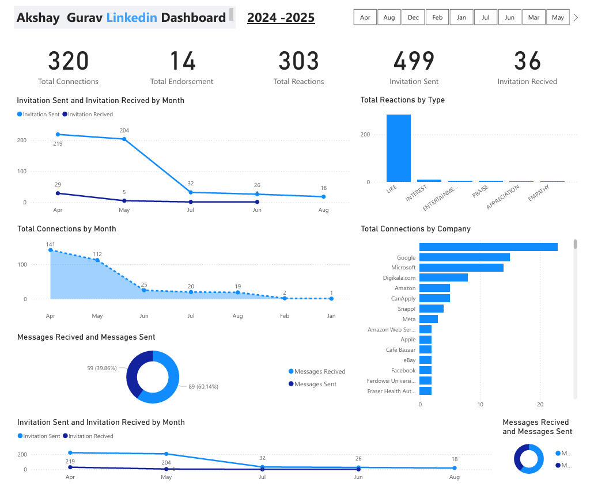

# 🚀 LinkedIn Profile Dashboard | Power BI Analytics  
**By: Akshay Gurav**

<p align="center">
  
</p>

---

## 📌 Overview  
LinkedIn is one of the most powerful professional networks for job opportunities and career growth.  
In this project, I analyzed **my own LinkedIn profile** using LinkedIn’s official data export feature.

This dashboard helps to:
✅ Track profile performance  
✅ Understand engagement & connections  
✅ Monitor job-related activities  
✅ Evaluate networking growth

The best part — **No scraping!** ✅  
Everything is done using **official downloadable data**.

---

## 🛠️ Tools & Technologies

| Tool | Purpose |
|------|---------|
| **Power BI** | Data Visualization & Dashboarding |
| **Python (Pandas)** | Data Preprocessing |
| **LinkedIn Data Export** | Dataset Source |

---

## 📂 Project Structure

| File / Folder | Description |
|--------------|-------------|
| `linkedin dashboard.pbix` | Complete Power BI Dashboard |
| `preprocessing_data.ipynb` | Python script to clean LinkedIn data |

---

## 🔽 Download Your LinkedIn Data

Follow these simple steps:

1️⃣ Open LinkedIn  
2️⃣ Go to **Profile → Settings & Privacy**  
3️⃣ Click **Data Privacy**  
4️⃣ Select **Get a copy of your data**  
5️⃣ Download ZIP file when LinkedIn sends it

➡️ Extract the ZIP file to get CSV files

---

## 🧹 Data Preprocessing

Run the Python notebook to prepare data:

```bash
jupyter notebook preprocessing_data.ipynb
